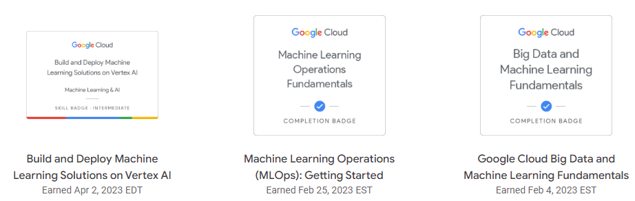

My notes from the following [Google Cloud ML Engineering Path](https://www.cloudskillsboost.google/paths/17) courses:
1. Google Cloud Big Data and ML Fundamentals
2. Machine Learning Operations (MLOps) Fundamentals
3. Build and Deploy ML Solutions on Vertex AI

[My Google Cloud Skill Boost Public Profile](https://www.cloudskillsboost.google/public_profiles/d85f8295-b522-4522-964c-f0fcf9375090)

**Note**: The content is best viewed in [Obsidion](https://obsidian.md/).
